# Elementum Domain-Specific Agent (DSA) Governance Framework

> Master framework for developing specialized AI agents with domain supremacy

## Architecture

```mermaid
graph TD
    classDef agent fill:#f9f,stroke:#333,stroke-width:2px
    classDef knowledge fill:#bbf,stroke:#333,stroke-width:2px
    classDef protocol fill:#bfb,stroke:#333,stroke-width:2px
    classDef governance fill:#fbb,stroke:#333,stroke-width:2px
    classDef monitoring fill:#ffb,stroke:#333,stroke-width:2px
    classDef core fill:#ddd,stroke:#333,stroke-width:2px

    subgraph Core["Core Components"]
        MCA["Master Control Agent"]
        GE["Governance Engine"]
        MS["Monitoring System"]
        P["Protocols"]
    end

    subgraph Agents["Domain-Specific Agents"]
        DSA1["PowerPoint Agent"]
        DSA2["Data Analysis Agent"]
        DSAn["Custom Domain Agent"]
    end

    subgraph Knowledge["Knowledge Bases"]
        KB1["PowerPoint Knowledge"]
        KB2["Data Analysis Knowledge"]
        KBn["Custom Domain Knowledge"]
    end

    subgraph Protocols["Interaction Protocols"]
        DP["Direct Protocol"]
        MP["Mediated Protocol"]
        CP["Collaborative Protocol"]
        SP["Supervised Protocol"]
    end

    subgraph Governance["Governance & Compliance"]
        DR["Domain Rules"]
        VR["Validation Rules"]
        PR["Performance Rules"]
    end

    subgraph Monitoring["Performance Monitoring"]
        RT["Response Time"]
        A["Accuracy"]
        PM["Performance Metrics"]
    end

    Human["Human User"] --> CLI
    CLI["Command Line Interface"] --> MCA
    MCA --> DSA1
    MCA --> DSA2
    MCA --> DSAn
    DSA1 --> KB1
    DSA2 --> KB2
    DSAn --> KBn
    P --> DP
    P --> MP
    P --> CP
    P --> SP
    GE --> DR
    GE --> VR
    GE --> PR
    MS --> RT
    MS --> A
    MS --> PM
    MCA --> GE
    MCA --> MS
    MCA --> P

    class MCA,GE,MS,P core
    class DSA1,DSA2,DSAn agent
    class KB1,KB2,KBn knowledge
    class DP,MP,CP,SP protocol
    class DR,VR,PR governance
    class RT,A,PM monitoring
```



## Overview

Elementum DSA is a comprehensive framework for creating, deploying, and managing domain-specific AI agents that excel in targeted knowledge domains. The framework enforces robust knowledge structures, standardized interaction protocols, and strict governance policies.

## Key Features

- Standardized agent implementation templates
- Version-controlled knowledge bases
- Cross-agent collaboration protocols
- Performance monitoring systems
- Governance and compliance frameworks

## Repository Structure

- `/core` - Core framework components and interfaces
- `/agents` - Agent templates and implementations
- `/knowledge` - Knowledge base structures and schemas
- `/protocols` - Interaction and communication protocols
- `/examples` - Example implementations
- `/docs` - Comprehensive documentation
- `/tests` - Test frameworks and validation tools

## Installation

### Option 1: Development Installation

```bash
# Clone the repository
git clone https://github.com/PWereh/elementum-dsa-project.git
cd elementum-dsa-project

# Install in development mode with all dependencies
pip install -e ".[dev]"
```

### Option 2: Regular Installation

```bash
# Clone the repository
git clone https://github.com/PWereh/elementum-dsa-project.git
cd elementum-dsa-project

# Install the package
pip install .
```

## Usage

### Using the CLI

```bash
# Process a single query
elementum-dsa --query "Generate presentation structure for technical overview" --domain "presentation_development"

# Process queries from a file
elementum-dsa --query-file example_queries.json --output-file responses.json

# List available agents
elementum-dsa --list-agents
```

### Programmatic Usage

```python
from elementum_dsa import ElementumDSA

# Initialize the framework
framework = ElementumDSA()

# Process a query
response = framework.process_query(
    "Generate presentation structure for technical overview", 
    domain="presentation_development"
)
print(response)

# Get available agents
agents = framework.get_available_agents()
print(agents)
```

## Creating a Custom Agent

```python
from elementum_dsa import create_custom_agent

# Define knowledge implementation
def custom_knowledge():
    return {
        "core_knowledge": {
            "concepts": {
                "custom_concept": "Definition of custom concept"
            },
            "terminology": {
                "custom_term": "Definition of custom term"
            },
            "principles": {
                "custom_principle": "Description of custom principle"
            }
        },
        "rules": {
            "constraints": {
                "custom_constraint": "Description of custom constraint"
            },
            "requirements": {
                "custom_requirement": "Description of custom requirement"
            },
            "guidelines": {
                "custom_guideline": "Description of custom guideline"
            }
        },
        "best_practices": {
            "recommended": {
                "custom_practice": "Description of recommended practice"
            },
            "optional": {
                "custom_practice": "Description of optional practice"
            },
            "discouraged": {
                "custom_practice": "Description of discouraged practice"
            }
        },
        "validation": {
            "input": {
                "custom_rule": "Description of input validation rule"
            },
            "process": {
                "custom_rule": "Description of process validation rule"
            },
            "output": {
                "custom_rule": "Description of output validation rule"
            }
        },
        "integration": {
            "apis": {
                "custom_api": "Description of custom API"
            },
            "services": {
                "custom_service": "Description of custom service"
            },
            "data_sources": {
                "custom_source": "Description of custom data source"
            }
        }
    }

# Create custom agent
custom_agent = create_custom_agent(
    domain="custom_domain",
    version=1.0,
    capabilities=["capability_1", "capability_2", "capability_3"],
    knowledge_implementation=custom_knowledge
)

# Register with framework
framework = ElementumDSA()
framework.register_agent(custom_agent)

# Use custom agent
response = framework.process_query(
    "Process with capability_1",
    domain="custom_domain"
)
print(response)
```

## Agent Collaboration

```python
from elementum_dsa import ElementumDSA

# Initialize framework
framework = ElementumDSA()

# Collaborative query
response = framework.collaborate(
    "Create a presentation with statistical analysis",
    primary_agent_id="Elementum-DSA-PRESENTATION_DEVELOPMENT-AGENT-V1.0",
    support_agent_ids=["Elementum-DSA-DATA_ANALYSIS-AGENT-V1.0"]
)
print(response)
```

## Performance Monitoring

```python
from elementum_dsa import ElementumDSA

# Initialize framework
framework = ElementumDSA()

# Get performance metrics
metrics = framework.get_performance_metrics()
print(metrics)
```

## Documentation

- [Agent Development Guide](docs/agent-development.md) - Detailed guide for agent development
- [Knowledge Development Guide](docs/knowledge-development.md) - Guide for knowledge base development
- [Protocol Development Guide](docs/protocol-development.md) - Guide for protocol implementation
- [Governance Guide](docs/governance.md) - Governance and compliance guidelines
- [Integration Guide](docs/integration.md) - System integration guidelines

## Contributing

Please read [CONTRIBUTING.md](CONTRIBUTING.md) for details on our code of conduct and the process for submitting pull requests.

## License

Copyright © 2025 Elementum Team. All rights reserved.