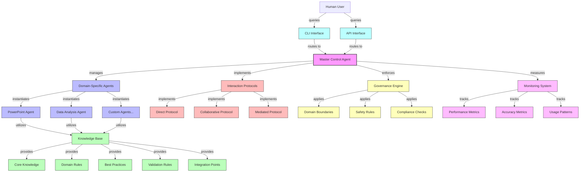

# Elementum Domain-Specific Agent (DSA) Governance Framework

> Master framework for developing specialized AI agents with domain supremacy

## Framework Architecture



## Overview

Elementum DSA is a comprehensive framework for creating, deploying, and managing domain-specific AI agents that excel in targeted knowledge domains. The framework enforces robust knowledge structures, standardized interaction protocols, and strict governance policies.

## Key Features

- Standardized agent implementation templates
- Version-controlled knowledge bases
- Cross-agent collaboration protocols
- Performance monitoring systems
- Governance and compliance frameworks

## Repository Structure

- `/core` - Core framework components and interfaces
- `/agents` - Agent templates and implementations
- `/knowledge` - Knowledge base structures and schemas
- `/protocols` - Interaction and communication protocols
- `/examples` - Example implementations
- `/docs` - Comprehensive documentation
- `/tests` - Test frameworks and validation tools

## Installation

### Option 1: Development Installation

```bash
# Clone the repository
git clone https://github.com/PWereh/elementum-dsa-project.git
cd elementum-dsa-project

# Install in development mode with all dependencies
pip install -e ".[dev]"
```

### Option 2: Regular Installation

```bash
# Clone the repository
git clone https://github.com/PWereh/elementum-dsa-project.git
cd elementum-dsa-project

# Install the package
pip install .
```

## Usage

### Using the CLI

```bash
# Process a single query
elementum-dsa --query "Generate presentation structure for technical overview" --domain "presentation_development"

# Process queries from a file
elementum-dsa --query-file example_queries.json --output-file responses.json
```

### Programmatic Usage

```python
from core.mca import MasterControlAgent
from examples.powerpoint.powerpoint_agent import PowerPointAgent
from examples.data_analysis.data_analysis_agent import DataAnalysisAgent

# Create Master Control Agent
mca = MasterControlAgent()

# Register agents
mca.register_agent(PowerPointAgent())
mca.register_agent(DataAnalysisAgent())

# Process a query
response = mca.process_query(
    "Generate presentation structure for technical overview", 
    domain="presentation_development"
)

print(response)
```

## Creating a New Agent

See the [Implementation Guide](docs/implementation-guide.md) for detailed instructions on creating your first domain-specific agent.

## Documentation

- [Agent Development Guide](docs/agent-development.md) - Detailed guide for agent development
- [Knowledge Development Guide](docs/knowledge-development.md) - Guide for knowledge base development

## Contributing

Please read [CONTRIBUTING.md](CONTRIBUTING.md) for details on our code of conduct and the process for submitting pull requests.

## License

For internal use only. All rights reserved.